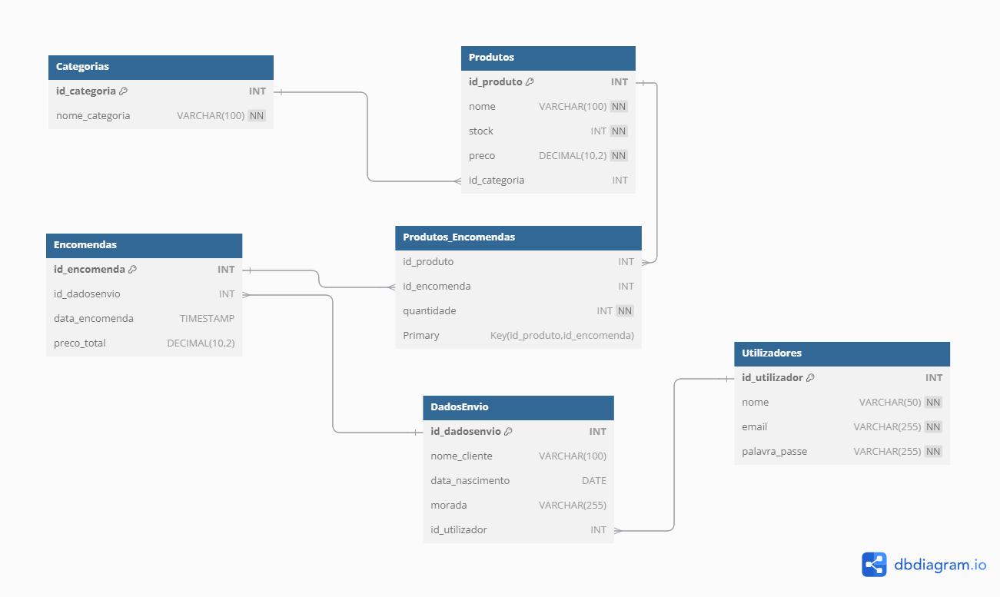

# Tugames - Loja de Jogos Online

Tugames é uma aplicação web para uma loja virtual de jogos, desenvolvida utilizando **PHP**, **HTML**, **CSS**, **JavaScript** e **jQuery**. Este projeto foca em funcionalidade e design responsivo.

---

## Live Demo  
Você pode verificar a live demo do projeto clicando no link abaixo:  

👉 [Acesse a Live Demo](https://tugames.valdirprogramacoes.club/)  

---

## 🛠️ Tecnologias Utilizadas
- **HTML5 e CSS**: Para estruturação e design responsivo.
- **JavaScript/jQuery**: Para interatividade e manipulação no front-end.
- **PHP**: Para lógica de negócio no back-end.
- **MySQL**: Para gestão e armazenamento de dados.

---

##📌 Templates Utilizados
- **Lugx Gaming**: Template utilizado para o frontend da loja.
- **AdminLTE 3.2.0**: Utilizado para o painel de administração e gerenciamento de utilizadores.

---

## 📂 Estrutura do Projeto
- `/src`: Código-fonte principal da aplicação.
- `/database/tugames.sql`: Script SQL para criar e configurar a base de dados.

---

## 🚀 Configuração do Projeto

### 1. Clonar o repositório
```bash
git clone https://github.com/AndreGomes-pt/tugames
cd tugames
```

### 2. Configurar o servidor local
Certifique-se de ter um ambiente local de desenvolvimento como **XAMPP**, **WAMP** ou **Laragon**.

- Copie a pasta do projeto para o diretório raiz do servidor local (por exemplo, `htdocs` no XAMPP).
- Inicie os serviços Apache e MySQL.

### 3. Configurar a base de dados
- Aceda ao **phpMyAdmin** ou a outro cliente MySQL.
- Crie uma base de dados chamada `tugames`.
- Importe o ficheiro SQL localizado em `/database/tugames.sql`.

### 4. Configurar o ficheiro de conexão
No ficheiro de conexão (`/src/dashboard/assets/db/db.php`), verifique se as credenciais estão configuradas corretamente:
```php
<?php
$host = 'localhost';
$dbname = 'tugames';
$username = 'seu_utilizador_mysql';
$password = 'sua_senha_mysql';

$conn = new mysqli($host, $username, $password, $dbname);

if ($conn->connect_error) {
    die("Erro de conexão: " . $conn->connect_error);
}
?>
```

### 5. Aceder ao site
Abra o navegador e introduza o seguinte URL:
```
http://localhost/tugames/src/
```

---

## 🧑‍💻 Utilizadores Padrão
A base de dados vem pré-configurada com os seguintes utilizadores de teste:

| Nome de Utilizador | Palavra-passe | Tipo de Acesso  |
|---------------------|---------------|-----------------|
| `demo`             | `demo`        | Utilizador padrão |
| `adminDemo`        | `adminDemo`   | Administrador     |

---

## 📖 Documentação
Os seguintes documentos estão disponíveis no diretório `/docs`:

1. **Diagrama da Base de Dados**:
   - Localização: `/docs/diagrama_base_de_dados.png`
   - Descrição: Representa as tabelas e as relações do projeto Tugames.



---
